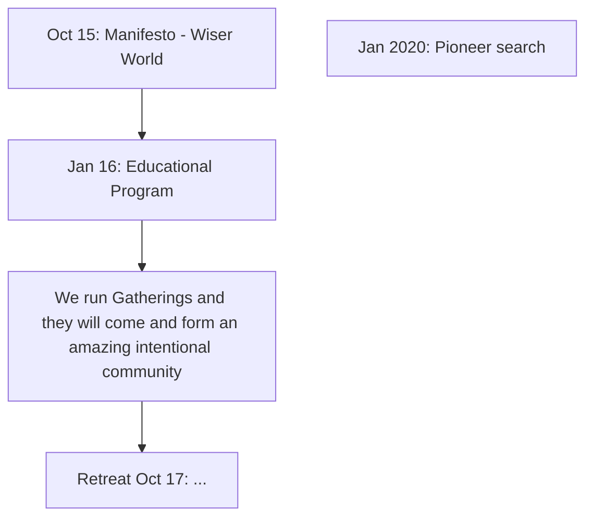

# 2022-02-24

# Standup

Last

* Theo: web 3 and comms meetings...
* Catherine: web3 and comms meeting. Ecosystem proposal.
* Eilidh: web 3, comms, tradition summaries
* Liam: residency marketing
  * Posted Rupert video (53, 69)
* Valerie: visiting at Petit Bois Martin

Next

* Rufus, Theo, Catherine, Eilidh: web3
* Theo WBCSD synthesis
* Liam: at conference re "Reimagining XXX"
* Rufus: Geoff, web3, spaces a little bit

# Comms meeting

Mainly in a google doc.

Main outcome: identified need to clarify for comms what we are up to and key offers right now (viz: spaces and labs). We did an issue tree and started answering it in a google doc.

![[../../excalidraw/comms-analysis-2022-02-24.excalidraw.svg]]

# A history of the evolution of our hypotheses at Life Itself

#todo/process 

Aka where have we come from and where are we going ...

* Why write this? ✅ because it helps Rufus make sense of where we are at and explain that to others ...
  * Which others and why do they care?

#aside the 3-d dimensionality of issue tree - answers fork into a diff dimension

## History

[[abc/life-itself-timeline]]

- 2016 Autumn: research calls
* 2017 spring sprint: Institute clarified
  * Rockefeller grant
* 2017 Sep: 1st nucleus retreat. 1st SCQH written = clarity that it was rare to find group with right qualities and we were seeking to shift the paradigm starting with a pioneering community
* 2018
  * London Hub up and running
  * Aug: 2nd nucleus retreat. Getting concrete plus some breakdowns
* 2019: 
  * Berlin Hub launches
* 2021
  * Berlin Hub clarifications

Hubs / Spaces evolution

* 2018-2019: Hub phase 1 in London
* 2019: Hub phase 2 (Berlin launch)
* 2020: Berlin continues + Bergerac Hub

# Inbox

Finished, active stuff

- [Engagement Pathways JtbD to Offers (2020) (G Drawing)](https://docs.google.com/drawings/d/136Rp8OBEoeE-cMk6-TIU4p1PIuTIE5EUDnQFz8SWDas/edit)
- Pioneer plan
  - [Pioneer Engagement Pathway - Hypothesis](https://docs.google.com/drawings/d/15fPOnAE5pdle8rZh3iPFobMmGxr04WLBWY2khg6KENg/edit)

Finished, archived stuff

- [AET Brand and Website Improvement 2020 Issue Tree and Research](https://docs.google.com/spreadsheets/d/1f6fkySbvd8XwzBG9-sdH5KhX1i77dmf9Wuzqw4nHA5M/edit#gid=1211596138) - had a lot of the key questions we have this time