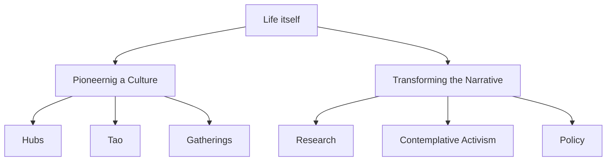
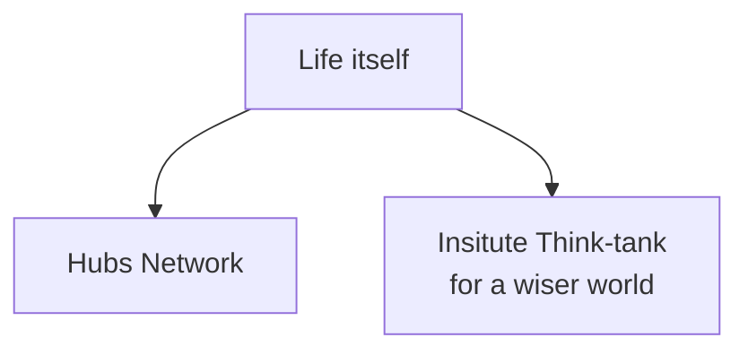

# Plans

What we want to do and **how** we are going to do that.

## Vision

Our intention is to bring about cultural and political transformation and to create a society that embodies our values of wisdom, well-being and awakening. We aim to achieve this by sharing the culture of Life Itself and by bringing a big vision conversation about social transformation into the mainstream.

### Long-Term

Within our lifetime and six generations hence, we will develop a federation of resilient, flourishing communities based on a shared culture (views, values and practices including the possibility of transformation, the primacy of (inter)being and getting stuff done). These communities will engage with broader society and ally with like-minded groups to foster a culture of wisdom and awakening [^1] that can transform society and will be committed to practical action, including large scale political efforts to address collective challenges.
 
See the full [[scqh|SCQH]] for context.

[^1]: Shorthand for "waking up, growing up, cleaning up and showing up".

### 30 Year Aspiration

A new way of being (waking up, growing up, cleaning up, showing up) has been sustained materially and psycho-socially over an extended period by a networked community. A community that is acting as:

* A home for transformation for its participants
* A demonstrator to the wider world
* An engine of wider social transformation (see next paragraph)

A new movement dedicated to political and cultural change has emerged based on a worldview aligned with Life Itself's. Policies and platforms have been created and enacted at a local, regional and even national level.

### The Next Five Years (2018)

Over the next 5 years we will continue to grow and share our culture and commitment to practical action by creating and expanding co-living hubs, increasing our outreach, generating more money to expand, and improving our branding. We will begin a big vision conversation about societal transformation which enters mainstream discourse.

More detail is in our [annual plans below](#annual-plans). If you want to know what we've been up to on a monthly basis, check out the updates on our [blog](https://lifeitself.us/blog/).

## How we do it

### Two Pillars

Our work focuses on two main workstreams or "pillars":

1. **Pioneering a culture**: creating a sustainable network of communities within existing society through hubs and businesses that are pioneering an "awakening" culture -- waking up, cleaning up, growing up (teal) and showing up -- as home, engine and demonstrator
2. **Transforming the narrative**: Catalysing a big vision conversation to transform the dominant narrative (worldview/paradigm) and associated political and cultural advocacy to enact related social and institutional change.

Pioneering a culture is more local and bottom up. Transforming societies is more societal level and focused on the wider narrative and engagement.

Another more "concrete" way to break down what we do based on the concrete activities/entities we have in those areas

 

### How do they connect?

At first glance, it may seem these two activities are unrelated. However, we believe they are mutually reinforcing in key ways:

[Source Drawing](https://docs.google.com/drawings/d/1lpXtY3p7NKfW1UO1RuJkjZAGI1OPzO0VvaiyqmJygso/edit)

## Pillar Specific Theories of Change

### Pioneering a Culture

### Transforming the Narrative

## Drilldown

Vision => Pillars => Programs => Projects

[Source Drawing](https://docs.google.com/drawings/d/1Lw32SijYsQrVAg6ICsRyEo0VENYwvehqqcTEsf9UM1A/edit)

## Programs

Life Itself will focus on 8 key work streams, with the primary focus in 2020 being the recruitment of value-aligned people (Pioneers, Contributors and Supporters):

1. Comms and Branding
2. Transforming the Narrative
3. Spaces
4. Pioneers
5. Business / Mutual Project Co 
6. Education 
7. Art
8. Core

![[../assets/tao/aet-workstreams-as-of-2020.png]]

Life Itself Workstreams as of Jan 2020 ([source coggle](https://coggle.it/diagram/XiR1dpbiFfqK6G8n/t/life-itself-workstreams-as-of-2020)A)

## Transforming the Narrative 

See our Transforming the Narrative Issue Tree, which details our plans for the workstream. [Transforming the Narrative](https://coggle.it/diagram/X5foU48kvlUMpNq_/t/transforming-the-narrative-issue-tree-is-widely-adopted)

## Annual Plans

* [[plan-2021|2021 Plan]]
* [[plan-2020|2020 Plan]]
* [[plan-2019|2019 Plan]]