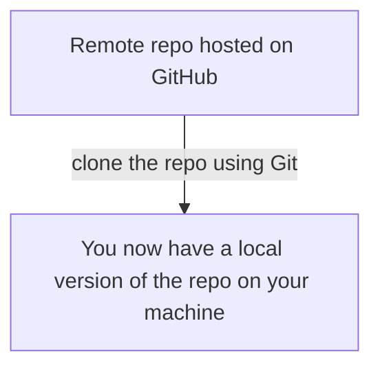
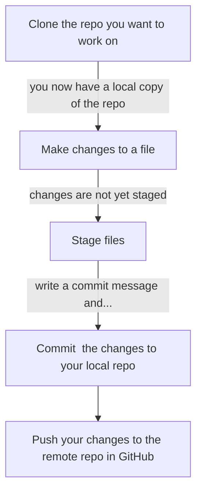
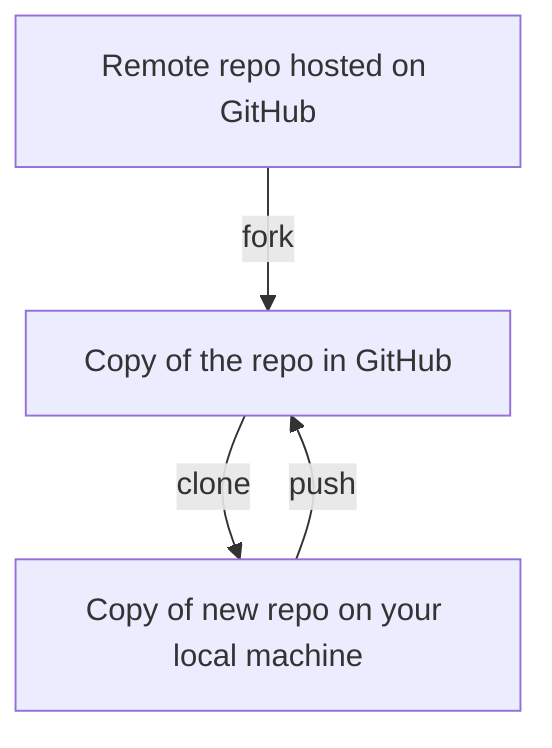
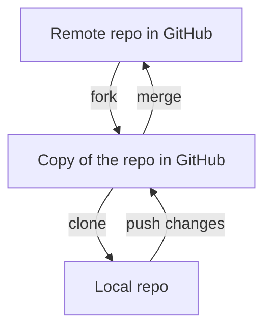
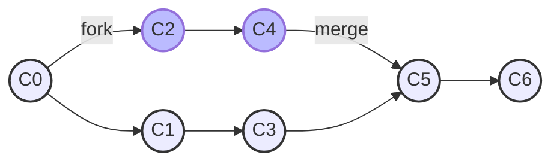
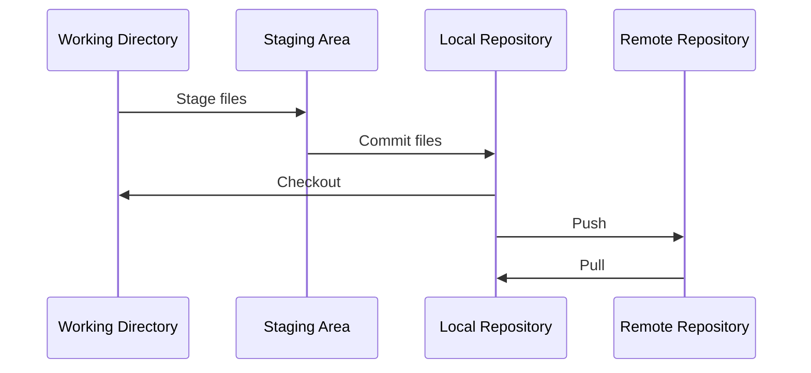

# An Introduction To Git

A beginner's guide on how to use Git on the command line (for Mac).

## Part One - What is Git?

### Git is a type of Version Control System (VCS)

Version control systems are software tools that track changes made to files and allow users to revert files to previous states. Git works by storing snapshots of files as they are at different points in time. 

If you're working with other people who use Git, or want to become good at using Git yourself, you'll need to understand a few concepts that will help make sense of everything else. This tutorial will introduce you to the basics so you can start working with Git.

### What's the difference between Git and GitHub?

GitHub is not the same as Git! Git tracks changes to files made over time and stores this information in repositories. GitHub is a website for hosting those repositories. 

### What are repositories?

Good question! A repository (or repo) is a storage space containing all the folders and files relating to a project, including all the snapshots of the files taken by Git at different points in time.

A repo hosted on GitHub is called a remote repo. If you're part of a team using GitHub to collaborate on a project, the remote repo will be the shared, online source for viewing files belonging to that project.

Using Git, you can copy a remote repo onto your computer by 'cloning' it. You then have an exact copy of the remote repo stored offline on your computer. This is called a local repo. You can work on the local repo without affecting the remote repo stored in GitHub. 

### How can files in a repository be edited and changes recorded using Git?

You can give Git instructions about what to do with files by typing into the command line (called Terminal if you're on a Mac). The command line is basically a text-based application for telling your computer to do things. You can use it to give Git instructions about what to do with files.

You could edit text files inside the command line, however you'll probably want to use a more user-friendly interface. In this case you can download an editor like Visual Studio Code. VSC has a user-friendly interface for editing files in Markdown, which is the language you'll use for working on files stored in repositories.

You can also open Terminal *inside* Visual Studio Code, so you'll be able to use Git on the command line without changing windows.

The rest of this tutorial will assume you're using Visual Studio Code to work with Git. 

### Sending changes you've made to a local repo back to the remote repo

If you make changes to a file in your local repo and want to integrate the changes into the remote repo, there are a few steps you need to follow. I'll explain how to do all these steps later in the tutorial; for now I'll just briefly cover what they are so you're familiar with the concepts.

#### Staging files

First you need to 'stage' the files. This tells Git that next time it takes a snapshot of changes you've made to your local repo, you want these changes included in that snapshot.

#### Committing and pushing

Next, you need to 'commit' the changes. This tells Git to take a snapshot of all the staged files in your local repo at that point in time and store it on your local machine, so it's always possible to refer to and revert back to that version of the files.

Once you've done that, you can 'push' the changes you've made to the remote repo in GitHub.

Here's a quick visual overview of the key steps involved in making edits to a file and and pushing it to GitHub:

### Forking, branching and merging

These are the final concepts we'll cover in this section.

#### What is forking?

Rather than clone the remote repo stored in GitHub to our local machine and push changes back to it, we can choose to fork the repo first, which creates an exact copy of it on GitHub. 

Now instead of cloning the original remote repo, we can clone the *copy* that we've just created. We can work on our local copy of this repo and push any changes back to that copy on GitHub, without affecting anything in the original repo we cloned.

#### What is branching?

Branching is more light-weight than forking. Rather than creating an exact copy of a repo including all the commits that have been made to it, branching just creates a snapshot of the repo at a point in time. You can work on the new branch without affecting the master branch, before merging the branches back together when you want to incorporate your changes.

#### What is merging?

When you create a new branch or fork a repo, change the files, and push the changes to GitHub, you have the option to create a Merge Request, which is essentially a request to merge one branch or repo into another. 

If your changes are approved by the repository's owner, the changes can then be merged.

When we tell Git to merge commits made on two different branches or repos, Git can carry out the merge as long as the changes do not conflict with each other (i.e. the same part of a file has not been changed in two different ways).

Git returns to the 'most recent common ancestor' it can find to check there aren't any conflicts.

Here's a diagram to help illustrate. Each of the nodes in the diagram represents a commit (a snapshot of the repo at a point in time).

At C0 a new branch is created and commits are made on each of the two branches, recording changes made to files. Git is then told to merge the branches back together.

Git identifies C0 as the common ancestor of C3 and C4. Going back to the snapshot made at C0 allows Git to identify what has since been changed and ensure the changes aren't in conflict before merging the branches back together.

#### Why are forking, branching and merging useful?

Branching and forking are especially important when collaborating with others, because they avoid changes being pushed directly to the master branch or original repo without prior reviews, tests and approvals. 

For example, you might want to use branching or forking if you're working on a website that's being deployed from the master branch. You can fork the repo, clone it so you have a local copy of the repo, make your changes and push them back to GitHub all without affecting anything on the live site. 

Your team can then view and approve your work before the changes are approved via a merge request and deployed to the live site.

## Part Two - Setting up

In this part of the tutorial you will learn how to do some of the basics of using Git and GitHub yourself; how to install Git, how to clone a repository and how to edit files in a repository.

### How to install Git

If you have never used the command line before, I would suggest you download Git through a browser: https://git-scm.com/download/mac

However, if you want to try using the command line from the get go or have some idea how the command line works, type in
> git --version
> 
and you will be prompted to download it.

Once downloaded, you want to set up your identity on the command line and in Git. Think of it as 'logging in', even though you're not doing it online.

> git config --global user.name "Jane Doe"
>
> git config --global user.email "email@example.com"
> 
Note: replace the example email with your email address and keep the inverted commas around it.

If you're going to continue to use the Mac Terminal or command line to run Git, you don't need this next step. However, if you're planning on using another text editor, you need to configure it so that everything works on there instead. [You can download Visual Studio Code here.](https://git-scm.com/book/en/v2/Appendix-A%3A-Git-in-Other-Environments-Git-in-Visual-Studio-Code)

Whenever you see commands to be entered into the command line in this tutorial, you can use the Terminal in Visual Studio Code if you prefer. You can access this by opening Visual Studio Code, clicking on 'Terminal' at the top of the window and then clicking 'New Terminal.'

The command to change your text editor is
> git config --global core.editor "editor name"
> 
To check that everything is working, type in
> git config --list
> 

You should see the username and email you set up.

Your basic set up is complete! 

Onto the next steps.

### Cloning a repo

#### First you need to make an SSH Key
>
There are two ways to link your local machine with your GitHub account: with HTTPs or SSH. The latter is handier to learn how to use, so for this tutorial that's what I'll tell you how to do.

1. Open your terminal 
2. Generate a new key pair by typing the below into the command line

> ssh-keygen -t ed25519 -C "email@example.com"
> 
Note: replace the example email with your email address!

3. You'll be asked to put in a file path where you want to save your new SSH key. As this is the first one you're making, just use the one the terminal provides for you by pressing 'enter'. If you don't want to add a password to your key, press 'enter' again

Congrats! You've now made your SSH Key. Now, to put it into GitHub.

1. Copy the key code to your clipboard using this command
> pbcopy < ~/.ssh/id_ed25519.pub
> 

Alternatively, you can find your key code manually by copying the following file path into your file explorer:
> C:\Users\user\\.ssh\id_ed25519.pub
> 
2. Go online to your GitHub account. Click your Avatar (your little profile picture), then 'Settings', then 'SSH key.' The correct page you're looking for will look like this:

3. Double-click in the text window and paste your copied code from before. Give your key a title (ex. 'Bethany Laptop'), and click 'Add Key'
4. Voila! Your SSH Key is now ready to use

#### Next create the folder on your local machine that you want to clone a repo into

Create a new folder (such as on your Desktop or in your Documents), and name it something like 'git work' or 'src' (src is source). This will be the location into which you clone repositories.

Then open the command line and type:

> cd desktop
>
> cd src
> 

The cd command stands for "change directories". So, assuming you called your folder "src" and saved it on the desktop, by typing these commands, you are now in your src file through the command line. If you called it something else, or located it elsewhere, you'll need to replace the commands, e.g.

> cd documents
>  
> cd git work
> 

If you tell Git to clone a repository while in your src folder on the command line, the repository will be cloned into the src file on your local machine.

#### Time to clone a repo!

Now that you've created your SSH key, and initialised your computer to send your files to and from GitHub, cloning a repo is extremely easy; but first you need one to clone.

#### Clone a repository that already exists in GitHub

This is really simple.

First navigate to the repo in GitHub.

In the right corner there is a blue button that says 'clone' with a little arrow on it. Click on that, and the options will come up to clone with SSH or HTTPs. Copy the SSH key.

Now go back into the command line.

First use

> cd desktop
>
> cd src
> 
to navigate to the folder into which you want to clone the repo.

Then type
> git clone "SSH Key"
> 
Making sure you paste the SSH Key you copied from GitHub in the place of "SSH Key". If you look in the "src" folder, you will see your copy of the repo. Now you're ready to start working.

#### If you want to create a new repository in GitHub to clone

Go back onto GitHub. At the top right corner, under your Avatar, there is a green button called 'New Project'. Click that and go through the steps to create it

- project name
- project description
- project URL
- project slug
- project privacy

Once you've done that, click 'create project'. You will then come to the Project Page.

Click the clone button again, and repeat the steps in the previous section to make a copy of the repo on your local machine.

### Adding a file to your repository

Make sure you're in the correct space

As a reminder:

> cd desktop
>
> cd src
>
> cd "new-project"
> 
Now you can add a new file to the repo. A simple README, for example, would be added like so:

> touch "README.md"
>
> nano "README.md"
>
>####ADD YOUR INFORMATION
>
>####Press: control + X
>
>####Type: Y
>
>####Press: enter
>
(Replace README with whatever you want to call your file!)

Now you have a README file, and you can use this format to create other files in your repository.

### Tracking files

To check the changes you have made after creating your file, navigate to your local repo in the command line and type
> git status
> 
This command will show your tracked and untracked files, as well as any change you've made to tracked files which you haven't staged (in other words, changes you haven't told Git to include in the next commit). The file you just created will be untracked.

Tracked files are files Git knows about.

To tell Git to track your new file, type

> git add "README.md"
> 

To check the file is now tracked, type 
> git status
>

## Part Three - Contributing to a project

Once you've edited a file in Visual Studio Code, there are a few steps you need to follow to add it to the remote repo in GitHub. 

### Staging

If you want changes made to a README file to be included in the next commit (the snapshot Git takes of your local repo,) you need to tell Git to stage the file.

You can do this by running the 'git add' command again after you've made your changes to the file (note you'll need to have navigated to the repo in Terminal before using these commands):

> git add "README.md"
> 
> git status
>

The diagram below visualises what is meant by untracked, modified and staged.

### Committing

#### Committing changes

To commit a file, first save and stage it, then type a commit message into Terminal to record the changes that have been made.

> git commit -m "my commit message"

Note that this command will commit changes you've made to any staged files within the location you're in inside Terminal, so use "git status" first to check what you've asked Git to include in the commit.

#### How to write a commit message

We write commit messages in a specific format:
* As an example, if we're adding a new blog post we might write [content/post][m]: post on "title of book"
	* The first brackets contain the file path
	* We put s/m/l/xl in the second set of brackets to describe the size of the change
	* Finally we write a short message explaining the change we made

You can look on GitHub for more examples of commit messages.

### Pushing changes to GitHub

Once you've committed your changes and you're happy with them you can push them to GitHub. This is the final step. 

> git push "README.md"
> 
[(For more information on these commands.)](https://git-scm.com/book/en/v2/Appendix-C%3A-Git-Commands-Basic-Snapshotting)

### Pulling changes from GitHub

If changes are being made to the remote repo while you're working on your local copy, you will need to 'pull' the latest changes from GitHub to ensure your local copy is up-to-date before you push changes to GitHub. This ensures any changes and commits you make store in GitHub properly.

To do this type

> git pull <REMOTE> <name-of-branch>

> *REMOTE is the name of the remote repository you want to pull from, usually 'origin,' and name-of-branch is the name of the branch in the remote repo that you want to pull from. This will usually be 'master.'*

If you just want to view differences between your local and remote repo, type:

> git diff

Once you're happy with the changes you have made, and have tracked and committed them using the 'git add' and 'git commit' commands from before, you 'push' the repo back to GitHub.com:

> git push <REMOTE> <name-of-branch>

### Putting the steps together

You might find it helpful to have a visual image of where the file you're working with is at each stage of this process.

The working directory is a single checkout of one version of your local repo. These files are pulled out of the compressed database in the Git directory and placed on disk for you to use or modify.

The staging area is a file, generally contained in your Git directory, that stores information about what will go into your next commit. You may see the 'staging area' referred to as the 'index' in some tutorials.

The Git directory is where Git stores the metadata and object database for your project. This is the most important part of Git, and it is what was copied when you clone a repository from another computer.

### How to create a merge request

This is for when you've pushed changes to GitHub on a new branch and want to merge those changes into the 'main' branch.

If you want to create a new branch in your local repo, so that when you push the changes to GitHub they don't affect the 'master' branch in the remote repo:

**Git command**

> git checkout -b 'name of branch'

work on your file changes, stage, and commit:

> git add
>
> git commit -m "my commit message"

once you're done, push your branch to GitHub

> git push origin 'name of new branch'

In the output, GitHub will prompt you with a direct link for creating a merge request. Copy that link and paste it in your browser, and the 'New Merge Request page' will be displayed. 

### Git log

'Git log' is a command you can use after navigating to your local repo in Terminal. It allows you to view activity, such as your recent commits and merge requests.

## Part Four - Final tips for collaborating on GitHub

### Checking for whitespace

Committing changes to a project others are working on can be daunting, but understanding a few more basic things can make it as easy as working on your own project repository.

When submitting changes to a project, you have to make sure you haven't introduced "whitespace" - unnecessary spaces in your file, which can create unnecessary merge conflicts. This is mainly a concern if you're writing code for a project that others are working on at the same time as you. To check, run the command:

> git diff --check

And this will check for any whitespace errors and list them for you if there are any. If there aren't, you're ready to move onto the next step.

### Using 'fetch' and 'merge' instead of 'pull'

The 'git fetch' command fetches other work that other users have pushed to the remote repository. 'Git fetch' and 'git merge' together are the same as 'git pull.' 'Git fetch' can be useful because it allows you to check what changes have been made to the remote repo by other users before they are merged into your local repo.

> git fetch origin/master

> git diff master origin/master

> git merge origin/master

Use 'Origin/master' to describe the branch in the remote repo that you want to fetch if it's the master branch. 'Master' describes your local branch (providing you're working in your master branch! If not, replace it with the name of the branch you're working in).

*To see a visual explanation, and to learn how to contribute to bigger groups, go [here.](https://git-scm.com/book/en/v2/Distributed-Git-Contributing-to-a-Project)*

## GitHub

GitHub is another host for your GitHub repositories. You make an account the way you made a GitHub.com account.

You can use HTTPs to link your GitHub with GitHub, but you're also able to use your SSH key. Use the 'pb copy' command in the 'setting up your SSH key' part of this tutorial to copy it, and add it to your GitHub by going into Settings -> SSH Keys. Adding it to GitHub is the same process as when you added it to GitHub.

In GitHub, you 'fork' a project to make a copy of it to work on before pushing it back to the project owner.

*For more in-depth information on github contribution, go [here.](https://git-scm.com/book/en/v2/GitHub-Contributing-to-a-Project)*

## Creating Issues

An issue is a way to put ideas/tasks into GitHub without impacting your repo. They can be edited to be open or closed, with the ability to organise them with tags, assign them to people in the group and apply due dates.

The issue can be written in Markdown, and is a good way of tracking your 'to-do list' in a project. To make one, go onto your sidebar, find the tab that says 'Issues', and click the green and white button that says 'New Issue'. Fill it out, create the issue, and then it will be available to see for you and/or your group, depending on which repo you created it in.
