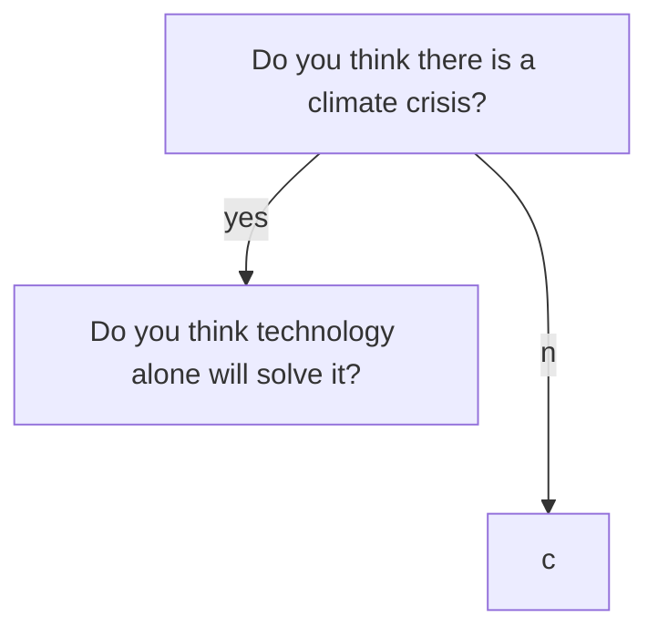

# 2021-12-17 - December Hack Day

Refs: [[sprints]], [[streams/sustainable-wellbeing]]

# Notes

Sustainable growth => Sustainable wellbeing

To the extent that you internalize the climate crisis narrative, the coincidence between wellbeing and addressing crisis (i.e. lower carbon) seems obvious and wonderful.

Aside: even supports our psychological resilience to address this

Tony Seba ...

---

Today: people think that solutions to the climate crisis that are *technically* feasible are *politically* infeasible and therefore focus on technically infeasible solutions in the hope they will become feasible through tech advance (OR: there is some structural / societal hack)

An important point about political feasibility is that it has large belief component: if everyone thinks X can't happen or isn't worth it, it won't happen. But beliefs can change quite quickly.

Political feasibility is a function of meaningful awareness (i.e. in our guts) -- do we believe climate change is real, will have a bad impact and feel that in our guts.

Our contention is that political feasibility will change non-linearly (ie. dramatically) at some point.

At that moment the overton window shifts dramatically.

At that moment people will want sustainable wellbeing policies ...

[Aside: some comment on the obsession with tech is that this point is made in tech stuff e.g. about AI all the time. Yet the same groups are often sceptical about political change. This is actually less perphaps about tech than about individualism vs collectivism biases ...]

Aside: the word "feasible" is used in 2 senses.

Skate to where puck will be: people accept reality at some point.

Enact these policies now ...

* Highest level:
  * Focus on human wellbeing (and defocus material growth e.g. GDP)
  * Prioritize 
* Carbon budget going to zero rapidly 
* Enact these specific policies
  * Egalitarian travel allowances

Typology of solutions [TODO]

People want painless solutions so they ignore the painful solutions that would work (but are politically unviable)

* Magic bullet solutions: 
  * Painless solutions
* Magic political solutions: they would 

Because people aren't there yet ...

Broader context

* People 

## questions

* Do you think we need decoupling
* Is green growth possible?
* Do you think material growth is compatible with sustainability (i.e. is decoupling possible)?
  * ~~Do you think we want no-growth or de-growth~~ Why: degrowth is confusing
* Do you think there is a possibility that your optimism is misplaced?
* If we achieve decoupling, will this lead to significant increases in human welfare?
* Do you think there are limits to how much consumption can improve human welfare?

* What is the goal of material growth?
* What technologies do you think will work?
  * Nuclear
  * Fusion
  * Solar

Thesis

* If you accept climate crisis
* If you think tech will save us =>
  * If risk you may be wrong (at least on timescale) =>
    * If no => do you think there are limits to how much consumption can improve human welfare?
    * If yes => what would be sensible
* If you think tech won't save us =>

Ultimate conclusion: we need sustainable wellbeing policies.

New version

* Do you believe in sustaining human welfare*
* Do you think there is uncertainty => 
* Do you think there is a risk of ecological disruption e.g. re climate change?

We need to plan to sustain (conserve) human welfare in any future circumstance that might arise in our uncertain world, including those in which the need to manage ecological disruption.

Rufus side questions

* What's the definition of "sustainable wellbeing"? **Increasing (or at least conserving) wellbeing whilst preserving the ecosystem over the long-term**
* How do we answer Geoff's skepticism about people saying this for a long time ...? {Liam note: well-being; }
* Skating to where puck is going to be

Asides:

* https://media.sitra.fi/2017/02/23221124/Towards_a_Sustainable_Wellbeing_Society_2.pdf

## ...

Current visions/solutions to climate crisis fall into two "infeasible" categories that can get conflated:

(NB: one issue is that diff people would even argue about whether one or other is infeasible e.g. technosolutionists would claim that tech is really close, whilst ...)

- Attractive in theory, but not yet implemented tech e.g. fusion power, solar at global scale (+ total electrification)
  - Business as usual and we've transitioned to zero-carbon economy
- Implement the zero carbon budget now (or by 2035) for the world ...
  - Politically infeasible to commit to zero carbon budget
  - Would def work ... we know how to do this.
  - Feasible in one sense: we can do this ...
  - Infeasible

2x2 feasible box

Technically feasible

Politically feasible

## Random

