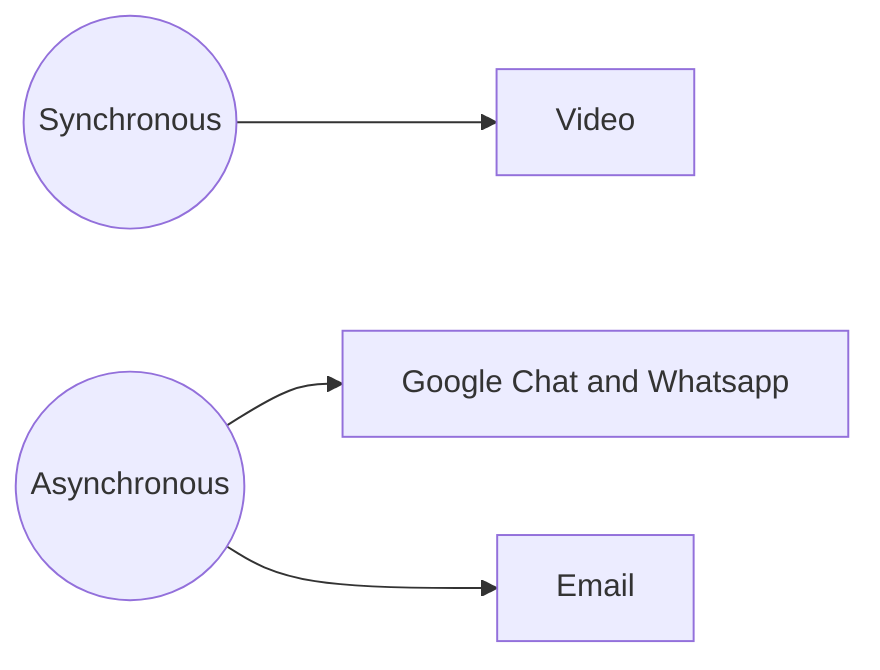

# Onboarding Guide

Welcome to Life Itself! 👣 🌱

This guide provides you with a simple step-by-step process to get set up at Life Itself so that you are ready to go. We have designed it to be largely self-service so you can do it on your own, at your own pace.

:::tip Feedback 📣
We value feedback 😄 You can make this handbook better by making amendments directly using the edit link at the bottom of each page (please check in with your Onboarder first). Or you can leave comments using Hypothesis (see below).
:::

## Onboardee Journey Overview

Your onboarding journey will consist of the following steps in order. Each stage will be covered in more depth further on in the guide.

1. [Prerequisites](#prerequisites)
2. Welcome Call - this will be set up by person onboarding you :smile:
3. [First Steps](#first-steps)
4. [How we Communicate](#how-we-communicate)
5. [Further Reading](#further-reading)
6. [Getting Help and Finding Stuff](#getting-help-and-finding-stuff)

## Prerequisites 

Before we get to the proper onboarding there are some essential prerequisites to get yourself set up.

Please complete as many of the following steps as you can on or before your Welcome Call so we can make sure you have access to all systems. Note: you can begin these steps the moment you have your email account and in advance of your official start date.

If you get stuck you will be able to ask your Onboarder questions during your onboarding call. 

1. **Life Itself email**: Login in to your Life Itself email account and check it. You should have received an invitation to your personal email with details of how to sign in to your Life Itself email account and set your password. Sign in and check your account for any email you may have already received.
2. **Key systems**: Setup your accounts on [the key systems we use](#key-systems). **Do this before the next step!**
4. **Phonebook**: Add your details to our [Phonebook using this form][phonebook]. Note: you will need to be logged in to your Life Itself email. Then, **notify the Onboarder that you have added accounts in team phonebook** so that they can add you to relevant systems.
5. **Laptop setup**: Setup your [laptop as per these Datopian instructions][laptop]. Some of these instructions may not seem obviously applicable to your role, but you are likely to find all of these programmes useful.
6. **Background on working with us:** Read about [Working with Us][]

[Working with Us]: /working-with-us/
[phonebook]: https://docs.google.com/forms/d/e/1FAIpQLSfgK-NrAkplGwO5OIPKfO3Gjyh0332aJaL0zwobk2qc4-lCLA/viewform?usp=sf_link
[laptop]: https://playbook.datopian.com/laptop-setup/

### Key systems

When you set up systems, try to pick usernames that will be easy for others to remember. Using your first and last name is ideal.

* Bitwarden -- https://bitwarden.com (password manager). Use Bitwarden to store your passwords as you work through the onboarding process.
* Gravatar -- https://gravatar.com. **You need to do this before any of the steps below so your Gravatar is used on the other accounts you create.** 
	* To be able to create a Gravatar, you have to create a WordPress account first. 
	* You can then create a Gravatar so that your profile picture will show up automatically on your profile on other systems. 
	* When you create your Gravatar, add your Life Itself email and *all* the email(s) you will use on other accounts.
	* [If you get stuck, you can read more about Gravatar here](https://wordpress.com/support/gravatars/)
* GitHub -- https://github.com. At Life Itself we use GitHub for collaborating on projects and deploying our website. 

---

## First Steps

### GitHub

We use GitHub https://github.com/ for a lot of project management as well as managing our code in git repositories. We want to introduce you to it here briefly because we will use its issue tracker functionality.

The issue tracker is space for storing and sharing task lists - you can think of it as an online notebook full of to-do lists. You can create an issue within the issue tracker to outline all the subtasks associated with something you're working on. Updating the issue records your progress and keeps your team up-to-date.

It's fine if you are unfamiliar with GitHub -- you only need the basics for now.

### Create an Onboarding Issue

You are going to track your onboarding progress using a GitHub issue in the onboarding project. **You will not be able to create issues if you have not been added to the relevant systems. Finish the [prerequisites](#prerequisites) first.**

* Please go to: https://github.com/life-itself/onboarding/issues
* Create your own issue and use it to track your Onboarding progress. Name it like `Onboarding {First Name} {Last Name} {Date}`
* Copy and paste the checklist below into your issue and modify it/add more learnings to it while going through the Onboarding process (eg. Markdown, GitHub, etc.).

```md
This is my exciting onboarding issue! 🌱

## Onboarding Essentials

### Prerequisites

* [ ] I have access to Life Itself email
* [ ] I have set up accounts on all the systems
* [ ] I have submitted my details via the Phonebook form
* [ ] I have set up my laptop

### First Steps

* [ ] Have created this issue in GitHub 😄
* [ ] I have access to GDrive
  * [ ] Have created my Email signature 
  * [ ] Doc Styles are set. Test by creating a google doc and checking that default doc styles are automatically applied (you can delete this document afterwards).
* [ ] Calendar
  * [ ] [settings] Add working hours
  * [ ] [settings] Check if your time zone is correct
  * [ ] Created a calendar meeting
  * [ ] Invited one or more other people to it
  * [ ] Deleted it
  * [ ] Add any days to your and the team calendar in next 2 months in which you will be away (delete these afterwards if inaccurate).
  * [ ] Confirmed I have the daily standup and fortnightly sprint meetings in my calendar
* [ ] Standups
  * [ ] Write a standup in Gchat
* [ ] Meetings
  * [ ] Create a meeting doc in the onboarding practice folder by copying the 'Meeting Template for Onboarding' doc: https://drive.google.com/drive/folders/1ACL1ztVfLoe79Akjc0mCx4QRkiMVCX8O
  * [ ] Structure the document according to the recommendation. Do as if you were going to introduce someone to the place where you live
  * [ ] Leave a comment in the doc asking whoever is onboarding you to review it
  
### Extra Steps
  
* [ ] Read about how to create a perfect issue in GitHub: https://tao.lifeitself.us/issues/
* Read about getting things done
  * [ ] Playbook: https://playbook.datopian.com/getting-things-done/
  * [ ] Rufus' write up (maybe just read the summary for now): https://rufuspollock.com/2019/05/27/getting-things-done/
* [ ] Read about SCQH: https://playbook.datopian.com/scqh/
* [ ] *Really* read about [job stories](http://playbook.datopian.com/job-stories/) (and user stories)
  * [ ] 📝 Summarize in your own words with examples why "so that" is so important 
* [ ] 📝 At end: notify your onboarder if you made comments (using hypothesis or otherwise) and put link to your comment stream e.g. https://hypothes.is/users/rufuspollock so that they can quickly find all your comments. 
```

### Google Drive

After setting up your email address, you will have access to **GSuite**, and of course, [Google Drive](https://drive.google.com/drive/).

The Onboarder will have granted you access to relevant Team Drives, so you can access and store the information / documents you require.

* Any new documents / sheets / presentations you create should be created in the appropriate folder in the Team Drive, **not your personal drive**. This speaks to our open and collaborative working culture and avoids having to explicitly share files with people.
* If you require access to files that you currently don't have access to, please reach out to your Onboarder.

#### Create your E-mail signature

Please implement this [E-mail signature template](https://docs.google.com/document/d/15asO0IVqAyUJrv0RHT6IkXAD3-kiUfN0mOj9LSqJH1c/edit?usp=sharing) into your gmail account. To do this, go to 'all settings' in Gmail and scroll down to update your email signature.

#### Install default styles

We use default styles for Life Itself so that our documents look neat and coherent. Follow the steps below to set up default styles for your documents in Drive.

* Go into [Doc Style Template](https://docs.google.com/document/d/1f_k9PSY44CXi39Pm9jKBmXdjsD1N0PpjPVtqE-HHhb4/edit#) 
* Then, click the menu item *Format → Paragraph Styles → Options → SAVE as my default styles*

Test it:

* Create a new document
* Start writing.
* Check the styles are correct: compare with the styles in the template.

### Calendar

It is expected that you keep your calendar up to date, so that if it shows as free, that means a colleague can add a meeting during that period.

#### Set Your Working Hours

Set your working hours in the Google Calendar settings so that people automatically get warned when they try to schedule a meeting outside of your working hours.

For instructions on how to set your working hours, see:

https://support.google.com/calendar/answer/7638168?hl=en

Working hours are according to the primary time zone you have set in Google Calendar.
For info on where to find your primary time zone in the settings, see:

* https://support.google.com/calendar/answer/37064?hl=en&co=GENIE.Platform=Desktop

#### View your teammates' calendars

* To see someone else's calendar, see others' calendars side by side or find a time that someone is free, see: https://support.google.com/calendar/answer/6294878?co=GENIE.Platform%3DDesktop&hl=en
* You can also add the calendars of the teammates you're mostly working with so you can easily see their availability. For instructions, see https://support.google.com/calendar/answer/37100?co=GENIE.Platform%3DDesktop&hl=en

## How We Communicate

### Communication

*As a virtual organization we need to have efficient, reliable, cost-effective ways to communicate and share material.*


#### Chat

We use Google Chat and Whatsapp for quick messages of which there is no need to keep a record. We use email for longer messages and messages that someone may want to refer back to. You'll be added to relevant groups as part of your onboarding.

#### Voice / Video calls

Our default tools for video are Google Hangouts and Zoom. We add a video call link to every meeting set up in Google calendar.

:::tip
Face to face communication is a big deal for humans. Facial cues are very important. Always prefer video over voice for synchronous.
:::

#### Email

We use Gmail.

#### Documents

We use Google Drive for all internal documents.

### Standups

Standups are part of the [agile methodology][https://playbook.datopian.com/agile/]. Agile is a project management tool, and standups are a way of outlining what you intend to work on over the next 24 hours. Their purpose is to:

* Keep the team in sync
* Identify blockers 
* Deal with issues arising (e.g. need to reprioritize in the face of an arising issue or change in estimate)

Traditionally, standups are done verbally "in person" (in a live team meeting e.g. on video). Life Itself holds standup every weekday at 17:15 CET. Your Onboarder will invite you to the standup event on Google calendar. If you can't attend a standup call, you should post your standup in a written form in our Whatsapp group so that your team members still get an update. The form of standup, either written or verbal, is as follows:

* Plan (What is your plan for the next 24 hours?)
* Recap (What did you accomplish during the last 24 hours?)
* Blockers (Is there something getting in the way of you completing your tasks)
* Availability (What is your availability for the next 24 hours?)

```md
* Last 24h: ...
* Next 24h: ...
* Blockers: ...
* Availability: ...
```

### Meetings

Make sure to familiarise yourself with our [meeting protocol](https://playbook.datopian.com/meetings/). 

### Markdown

Markdown is a markup language with plain text formatting syntax. We often use Markdown based tools, including HackMD and GitHub.

If you are new to Markdown, see the [Markdown tutorial](https://playbook.datopian.com/markdown/)

---

## Further Reading

We recommend you look at the reading below as part of your onboarding:

* Read [the culture page](/culture/) for an introduction to the principles behind Life Itself.
* You can also have a quick look around https://lifeitself.us/.

## Getting Help and Finding Stuff

We're fully remote so our equivalents of all the standard office chatting takes place either in Google Chat, Whatsapp 💬  or on video calls. 📺

If you need help, just message anyone directly and they'll be happy to help -- we are a friendly bunch. 🤗
