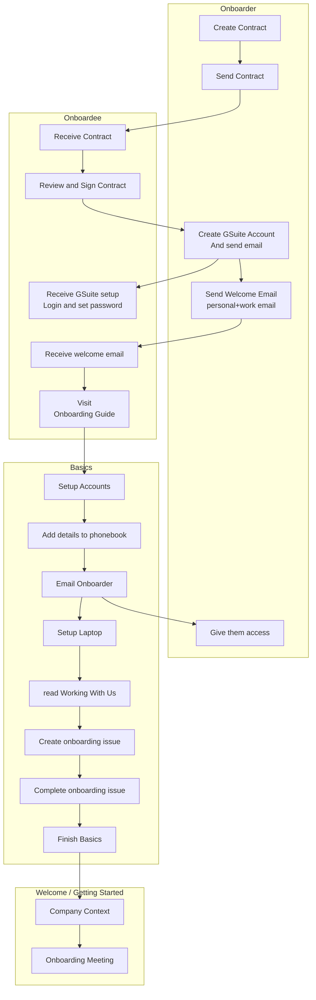

# Onboarding A New Team Member

## Principles

The onboarding process has been designed to be lean and simple.

A member of the Ops team will produce a contract and initiate the onboarding process. The following is a guide for carrying this process out with the Onboardee.

## User stories

* Onboarder = person setting up the new team member (needs to be authorised by Rufus or Sylvie).

**As the Onboarder** I want to know what I need to do for and with the Onboardee so they are set up and supported and nothing is missed out.

I need to know:

* Things I need to do before the Onboardee starts their onboarding (e.g. ensure they have a contract).
* Things to do during onboarding.
* Things to do after onboarding.

## Overview



## Onboarding Checklist: Issue template

* Go to https://github.com/lifeitself/ops/
* Create an issue to track the Onboarding process
* Name it `Ops Onboarding {First Name} {Last Name} {Date}`
* Copy and paste the checklist below into your GitHub issue
* Complete the steps to ensure the Onboardee has everything they need.

Next, scroll down for more detail on completing the steps.

```
* [ ] Contract drafted (and reviewed)
  * [ ] [Optional] Folder in Life Itself - People/HR > Contracts created
* [ ] Contract shared with the onboardee (CC the requestor and ops@lifeitself.us)
* [ ] Contract signed
* [ ] PDF created and sent to Onboardee
* [ ] GSuite email created
* [ ] ~~Add to all-team@lifeitself.us and other email groups as appropriate~~ (Automatic)
* [ ] Email sent to welcome onboardee
* [ ] Invite sent to welcome call
* [ ] Invite to daily standup on Google calendar
* [ ] Add to appropriate GChat channels
* [ ] Invite to Xero and add bank details
* [ ] Invite to Wordpress
* [ ] Add to Life Itself on Github once the Onboardee has created a GitHub account
* [ ] Welcome/Onboarding call complete
* [ ] Welcomed to the team on standup
* [ ] Confirm to the requestor that the Onboarding is complete
```

### General Onboarding Agreements

* We start onboarding new joiners early enough (at least 5-7 days in advance) so that
  * we leave them enough time to review and sign the contract and do the prerequisites on their end
  * we leave ourselves enough time to set up their accounts on our end and ensure their smooth onboarding
* The onboardee should be **fully** onboarded by us by the end of their first day (= Github issue fixed and closed)

### Create the Contract

1. Create a folder for the Onboardee in [Life Itself - People / HR/Contracts](https://drive.google.com/drive/folders/1pQNPDqDV4kJ95V1bgP8QgwoGJ1mavAnF)).
2. Create a draft contract:
    1. Copy the template contract which is stored [here](https://drive.google.com/drive/folders/1pdh9lXpMXib3Uxan0i7F5qe2H8UKKHw4).
    2. Move it to the Person's folder you created in Step 1.
    3. Rename it to `{Contractor Name} Life Itself Contract {Year}`.
    4. Fill in any relevant sections, especially the key terms in the Schedule section.
    5. Highlight everything that needs to be filled out by the Onboardee.

### Contractor Reviews

1. In Google Docs click Share and share with the contractor's personal email.
    * Make sure to tick "Skip sending notification" as you will notify them by email in the next step.
2. Email the contractor with the email below (**cc** ops@lifeitself.us).

    Subject: Your Life Itself Contract: Please Review and Complete

    ```
    Hello XXX,

    Welcome! This is your contract:

    {Insert Link to Google Doc}

    Please review and fill in any relevant highlighted sections. If you have any questions please note these as comments in the doc. Then:

    EITHER: you have questions. If so, please email us to let us know so we can get those resolved 😀

    OR: it all looks good and you have no questions. Please then sign (insert your signature and date) and email us to let us know. We will then sign and send you a copy.

    Many thanks,

    XXX
    ```

### Email Contract

Once both parties have signed we:

* Review the contract and remove the highlighted parts.
* Make a PDF of the contract.
* Store that in Drive in the contract folder for that contractor.
* Email the PDF of the signed contract to the contractor for their records **cc**'ing ops@lifeitself.us.

## Setup on Systems

:::warning
These steps can be done in parallel or out of order.

However, unless otherwise agreed, we should only do these steps **once there is a signed contract**.
:::

1. **GSuite Account and Email:** Create the Onboardee's email account as firstname@lifeitself.us (or firstname.lastname@lifeitself.us if necessary) on the Google Admin page and ensure the log-in details are sent to the Onboardee's personal email address. 

2. **Create accounts / send invitations** on systems where they can't create themselves

    * To add the Onboardee to Xero [see Xero access](https://docs.google.com/document/d/1bY7za2nRTN-shUDYQkW3_pjSP6G0RiEFiT5kpEOgY44/edit#heading=h.v59x2fkuxkjt) and add their bank account details once received.
    
3. **Welcome Call Invitation**: Send them an invitation for a Welcome Call within the next days.

4. **Welcome email:** Send them the welcome email to their Life Itself email.

    Subject: Welcome to Life Itself -- next steps in getting you set up

    ```
    Hi {XXX},

    Welcome to Life Itself. This is the beginning of an amazing journey! 🚀 👩‍🚀

    **1. Start Setting Yourself Up!**

    Please start getting yourself set up here:

    https://tao.lifeitself.us/onboarding/

    **Please complete as much of the Onboarding Guide as possible before your Welcome Call, making note of any questions you have**. Doing this allows us to grant you access to all systems and makes the the onboarding process super-smooth.
	
    **2. Welcome call**

    A welcome call has been scheduled and you will have received an invitation by email. Please accept the invite. 😊

    If you are **unable** to make that time please let us know asap by declining the invite and suggesting an alternative time!

    Looking to having you on board!
  
    Best,

    ...
    ```

## Welcome Call

Here is the suggested agenda for the Welcome Call with the new team member. It should usually take no more than an hour.

:::tip
The Onboarder should capture questions during the onboarding meeting and forward any questions they can't answer to other team members.
:::

**Welcome**

* Introduce yourself **[5m]**
* Ask them to intro themselves **[5m]**

**What this call is about -- intro to onboarding and company context**

* We’ve designed the onboarding process to be a self-service one but I’m just going to say a few words to intro you to the company.
* Overview of Life Itself.
  * What we do.
  * Team is global and fully remote, with team members in Germany, France and the UK.
  * Flat, self-organizing self-managing organisational set-up [very brief but this even informs the nature of this onboarding process!]
* Who they will be working with
* Talk about Values & Culture briefly, as our emphasis on culture is an important and distinctive part of our approach.
  * Why that’s important to us.
  * Example: Integrity.
* Does the Onboardee have any questions about culture not answered in the Tao?

**Onboarding**

The Onboarder should have completed most of the [Onboarding Guide](/onboarding/).

* Check that they have done steps and whether they have any blockers or questions **[15m]**
* Introduce the Onboardee to how we manage our website on Wordpress and answer any questions they have about our other systems, such as GitHub. Show them around the All-Team Google drive and ensure they know the location of key documents, such as those relating to accounts.
